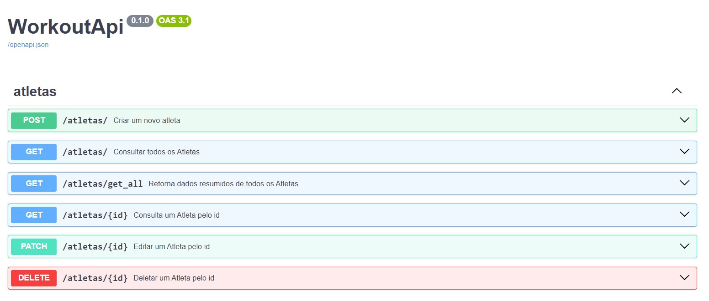

# FastAPI

Neste desafio foi criada uma  API utilizando FastAPI e banco de dados PostgreSQL. Foram feitos alguns ajustes em relação ao desafio fornecido. O arquivo Docker usado para subir o banco foi alterado para persistir os dados através de um volume, e foi colocado um código no arquivo que sobe a API que permite gerar um arquivo JSON com as rotas, o que permite a importação das rotas para o Postman

### Quem é o FastAPi?
Framework FastAPI, alta performance, fácil de aprender, fácil de codar, pronto para produção.
FastAPI é um moderno e rápido (alta performance) framework web para construção de APIs com Python 3.6 ou superior, baseado nos type hints padrões do Python.

### Async
Código assíncrono apenas significa que a linguagem tem um jeito de dizer para o computador / programa que em certo ponto, ele terá que esperar por algo para finalizar em outro lugar

# Projeto
## WorkoutAPI

Esta é uma API de competição de crossfit chamada WorkoutAPI (isso mesmo rs, eu acabei unificando duas coisas que gosto: codar e treinar). É uma API pequena, devido a ser um projeto mais hands-on e simplificado nós desenvolveremos uma API de poucas tabelas, mas com o necessário para você aprender como utilizar o FastAPI.

## Modelagem de entidade e relacionamento - MER


## Stack da API

A API foi desenvolvida utilizando o `fastapi` (async), junto das seguintes libs: `alembic`, `SQLAlchemy`, `pydantic`. Para salvar os dados está sendo utilizando o `postgres`, por meio do `docker`.

## INSTALAR O PPYENV NO WINDOWS

Abrir o PowerShell como administrador

Executar os seguintes comandos:

```
Set-ExecutionPolicy -ExecutionPolicy RemoteSigned -Scope LocalMachine

Invoke-WebRequest -UseBasicParsing -Uri "https://raw.githubusercontent.com/pyenv-win/pyenv-win/master/pyenv-win/install-pyenv-win.ps1" -OutFile "./install-pyenv-win.ps1"; &"./install-pyenv-win.ps1"
```

## Instalar o pyenv-win-venv

Abrir o PowerShell como administrador

Executar o seguinte comando:

```
Invoke-WebRequest -UseBasicParsing -Uri "https://raw.githubusercontent.com/pyenv-win/pyenv-win-venv/main/bin/install-pyenv-win-venv.ps1" -OutFile "$HOME\install-pyenv-win-venv.ps1";
&"$HOME\install-pyenv-win-venv.ps1"
```

## Criar o ambiente virtual

```
pyenv install 3.11.4
pyenv-win-venv install  3.11.4 workoutapi (os dois acima OK!)
pyenv-win-venv activate workoutapi (!importante_
```

## Dependências que foram instaladas

```
pip install fastapi uvicorn sqlalchemy pydantic alembic asyncpg	pydantic-settings fastapi-pagination
```

## Rodar o projeto

No terminal dentro do VScode, foi utilizado o seguinte comando

```
uvicorn worktout_api.main:app --reload
```

Para testar no navegador:
http://127.0.0.1:8000/
e 
http://127.0.0.1:8000/docs (Swagger)


Observação. O comando "make run" não funcionou no Windows. Seguir este passo a passo para instalar
https://medium.com/@samsorrahman/how-to-run-a-makefile-in-windows-b4d115d7c516


## Depois de instalar o alembic

```
alembic init alembic
pip freeze > requirements.txt

alterar o arquivo alembic.ini
para criar as migrations:
alembic revision --autogenerate -m "init-db"
```

## DOCKER 

No Windows, abrir primeiro o Docker Desktop. Depois, rodar o seguinte comando no terminal

```
docker-compose up -d
```

Para verificar se os containers estão ativos:

```
docker ps para conferir se subiu
```

Para encerrar a execução do container:

```
docker-compose down
```




No Docker foi instalado além do banco de dados Postgres a imagem  do PgAdmin. Ela permite que você conecte no banco de dados Postgres utilizando uma interface web.
AO USAR O PGADMIN NO DOCKER, O HOST DEVE SER DB, este é o nome do serviço no arquivo Docker


## Passo a passo

- cada rota tem uma pasta. Na pasta existe:
- O schema (o modelo de qual o formato dos dados e de como os dados devem ser recebidos e devolvidos)
- O model (a estrutura que deve ser criada no banco de dados)
- O controller (as rotas que devem ser acessadas para consumir ou editar o modelo)

Depois de fazer esta configuração, o controller deve ser adicionado no arquivo routes.py da raiz da pasta workout. O acesso as rotas deve ser habilitado lá.

Na paiz da pasta workout existe uma pasta chamada contrib. Nela existem configurações comuns que devem ser aplicadas a cada modelo/schema.

No arquivo models, foi adicionado um campo ID automático para cada registro
No arquivo schemas, foi adicionado um modelo de esquema de saida, que além dos campos definidos no schema que estpá senbdo utilizado (atleta, categoria ou centro de treinamento), ele retorna dois campos extras, id e created_at

Na raiz da pasta worktout_api, tem um arquivo __init__.py que tem os includes de todos os modelos utilizados no projeto


## repositório original :
https://github.com/digitalinnovationone/workout_api


## DESAFIO PROPOSTO

Instruções:
 
- adicionar query parameters nos endpoints (OK)
      - atleta
            - nome
            - cpf
- customizar response de retorno de endpoints (OK)
      - get all
            - atleta
                  - nome
                  - centro_treinamento
                  - categoria
- Manipular exceção de integridade dos dados em cada módulo/tabela (OK)
      - sqlalchemy.exc.IntegrityError e devolver a seguinte mensagem: “Já existe um atleta cadastrado com o cpf: x”
      - status_code: 303
- Adicionar paginação utilizando a lib: fastapi-pagination (OK!)
      - limit e offset
*https://uriyyo-fastapi-pagination.netlify.app/
 pip install fastapi-pagination
* No arquivo main.py da pasta workout, foi incluida a chamada para o paginador

# Referências

FastAPI: https://fastapi.tiangolo.com/

Pydantic: https://docs.pydantic.dev/latest/

SQLAlchemy: https://docs.sqlalchemy.org/en/20/

Alembic: https://alembic.sqlalchemy.org/en/latest/

Fastapi-pagination: https://uriyyo-fastapi-pagination.netlify.app/
